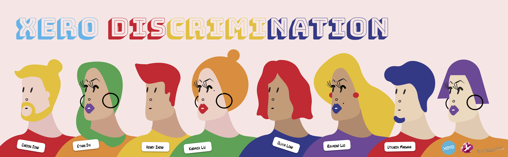

# XeroDiscrimination
TechLauncher Project 2019 S2 | Code: 19-S2-2-C Xero Discrimination
---
:link: **Quick Links**
> * [**GitHub Repository**](https://github.com/Utkarsh-Marwaha/XeroDiscrimination)
> 	* [Issue Board (ZenHub Board)](https://github.com/Utkarsh-Marwaha/XeroDiscrimination#workspaces/rainbow7-5d521985c4594626b3600b43/board?repos=202042365)
>	* [Minimum Viable Product (MVP)](https://github.com/Utkarsh-Marwaha/XeroDiscrimination#workspaces/rainbow7-5d521985c4594626b3600b43/board?repos=202042365): Under the MVP pipeline.
>	* [Acceptance criteria](https://github.com/Utkarsh-Marwaha/XeroDiscrimination#workspaces/rainbow7-5d521985c4594626b3600b43/board?repos=202042365): Xeros have assessed those MVPs and responded to them. See them by click on the cards.
> * [**Google Drive**](https://drive.google.com/drive/folders/16or-qAWaP47zYRBujUtLxquibFVMffwd)
>  	* [Project Plan](https://drive.google.com/open?id=1SB9oyRcp21_rfohmSQQdtWHxJnV5V1Ay)
>	* [Statement of Work (SoW)](https://drive.google.com/drive/folders/1qOL4Du4DMxNp0jUrjw0eTDZJfbZcw_oE)
>	* [Risk Register](https://drive.google.com/drive/u/0/folders/1PMRCn4jS3Ur-zPC1xj_NW_ijhUyR6ev7)
>	* [Descision Log](https://drive.google.com/drive/u/0/folders/18XHohg63HihipddTGb2wYRgnH8vlGodf)
>		* [Descision Making Process Flow Chart](https://drive.google.com/drive/u/0/folders/18XHohg63HihipddTGb2wYRgnH8vlGodf)
>	* [Feedback Log](https://drive.google.com/open?id=17opM28HwXkN9lNWn-Xqov2nKgrbP8UU318U0HRg5uKo)
>	* [Meeting Minutes & Related Outcomes](https://drive.google.com/drive/folders/169VP35T8-W4mUahAn6C6lPCQlQS187oB?usp=sharing)
>		* [Client](https://drive.google.com/open?id=1vc3TeHVgU1Vq6-Y29HxFt1Xkx-3eZDTW) Meeting
>		* [End User](https://drive.google.com/open?id=1rCV_ug61Qbb6UDWZ5-2Bvz3qek2n9rSn) Meeting
>		* [Audit](https://drive.google.com/open?id=1kezyvWSLgQJ2wjDgFBhbEjjY67mQWr2M) Meeting: Slides([1](https://drive.google.com/open?id=1tvMuiOZRrwKEXzSXKV5k_O5woK1OUlEq), [2](https://drive.google.com/open?id=14u1La-WundIx87Lg5z1T-w06dZDQP-2A), [3](https://drive.google.com/open?id=1qn2L24XhjbMwlSlg0rkPBNoOpHuxtk2S))
>		* [Team](https://drive.google.com/open?id=1arzk6l9_O8YybPrH0kaxIwK0ths6L3fP) / [Tutorial](https://drive.google.com/open?id=1C4UaNbOGimv8jshIyIePxW8_cET9NcnZ) Meeting
>	* [End User Testing](https://drive.google.com/open?id=18gqvqGhVzZDWSa4ZrAtFL8qN_p34Or0f)
>		* [Raw Dataset](https://drive.google.com/open?id=1oOTcOjIXANYLUUetfQKv-XSHVPR-XBBw)
>		* [Mapping Results](https://drive.google.com/open?id=1B2iga5l2LiMfU-7CfuF2J6yy8ClL2tBl)
>	* [Showcase Poster](https://drive.google.com/open?id=1ltiUQCcyGbkt4VDQtEBzp-M4R6VGYLvE)
> * **Supporting Documents**
>	* [End User Testing Session Snapshots](https://drive.google.com/open?id=15zp7NXvwh1mF8rbWCacpLxMA0dr5QOzW)
>	* [Client Meeting Snapshots](https://drive.google.com/drive/folders/1WJXr71ocib6bxigVTzI6vIyjT1Pv-xET?usp=sharing)

## :round_pushpin: Overview

### Background and Scope
Due to systematic and direct discrimination, young people in LGBTIQ communities face difficulties and challenges in finding jobs. On the other hand, employers who are friendly to the community have a hard time standing out. We all want to have a great experience when looking for our dream job or hiring the right person. This is the problem we want to solve by using technology.

### Stakeholder Concerns and Interests
* **[Stakeholder Analysis Chart](https://docs.google.com/document/d/1epvI6XaQV2DkQ-P9564PAwCpmkWzaDA2)**

### Minimal Viable Product - Iteration 1
* **[Statement of Work](https://drive.google.com/drive/folders/1qOL4Du4DMxNp0jUrjw0eTDZJfbZcw_oE)**
* **[User Story Map](https://drive.google.com/open?id=1PS4gMNf0QJ2Y59hs9PiB_H7XSiubzW37)**

## :round_pushpin: Project Team and Stakeholders
### Team Structure
* Rainbow 7:
	* Spokesperson: **Utkarsh Marwaha** (Architect, Communicator, Developer) _@u6146791_
	* Spokesperson: **Zhengqin (Raymond) Luo** (Front-end Developer, UI Designer, Communicator) _@u5469010_
	* Member: **Yilu (Karmick) Liu** (Front-end Developer, UI Designer, Managerment) _@u6270742_
	* Member: **Yishun (Ethan) Shi** (Front-end Developer, Tester) _@u6598369_
	* Member: **Jianzhen (Olivia) Long** (Back-end Developer, Tester) _@u5474453_
	* Member: **Chunxiang (Carson) Song** (Back-end Developer) _@u6302158_
	* Member: **Zheng (Henry) Xiang** (Back-end Developer) _@u6469050_
* Tutor: **Catherine Jaktman**, Email: Catherine.Jaktman@anu.edu.au
### Stakeholders
* Client:
	* Xero: **Shreyas Nagarajappa**, **Han Zhang**, **Mehika Manocha**, **Amanda Li**
* End-users:
	* LGBTIQ+ Community
	* YWCA

## :round_pushpin: Project Plan and Actions
### Schedule and Action Plans
This platform needs to meet the needs of multiple stakeholders and we only have very limited time to develop it. So we are going to use an agile software delivery technology called Scrum. We plan to take about ten weeks this semester to develop a prototype of the platform.
**Scrum** can help us deliver reliable products quickly. The development of the project will be divided into Sprints. Each Sprint last two weeks. The team will determine the functions that need to be implemented in this Sprint at the beginning of each Sprint. The new requirements that occur during each Sprint will be discussed and scheduled at the beginning of the next Sprint. This will ensure that the progress of the project in each period can be seen as quickly as possible.
* [Product Backlog](https://github.com/Utkarsh-Marwaha/XeroDiscrimination#workspaces/rainbow7-5d521985c4594626b3600b43/board?repos=202042365): Under the Backlog pipeline.
* [Workflow](https://docs.google.com/document/d/1vpVsB1WfnFJghHDhj2oB_8T0LCyMkpXN)
* [Project Plan](https://drive.google.com/drive/folders/1Iu3-M5JF8mSyvAnLL6TflXMhrUxbSZ6P)

Repository Created: 13/08/2019
Photo Resource: https://www.rawpixel.com/peera/showcase
